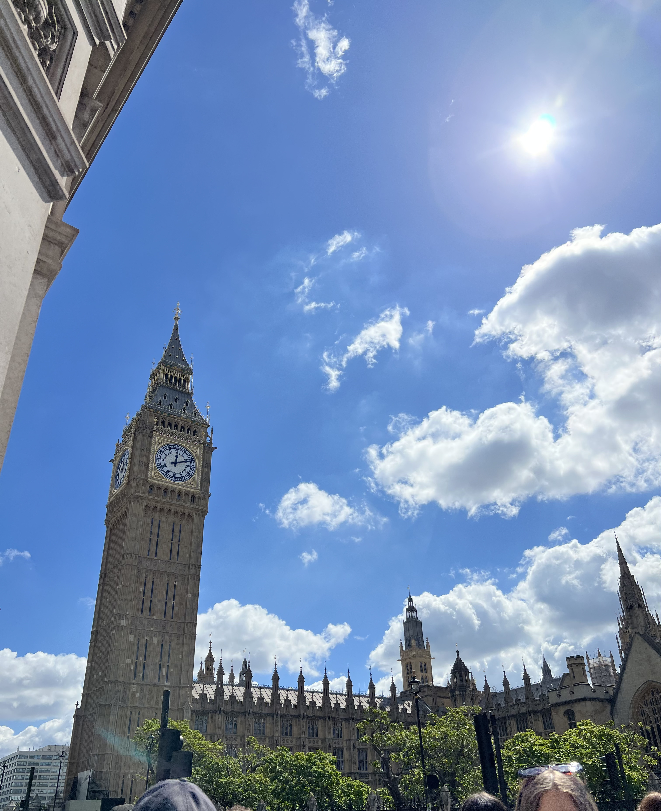
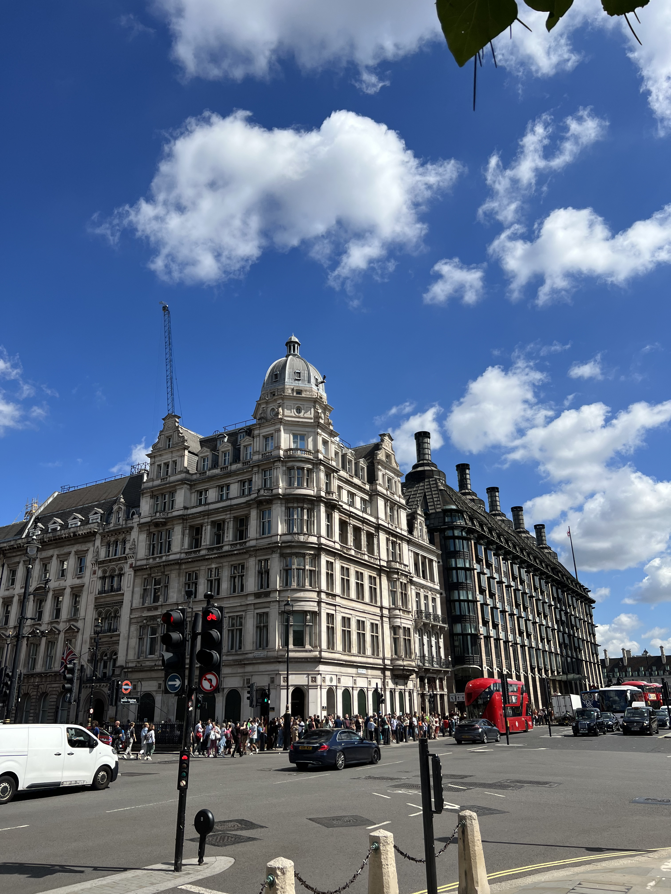
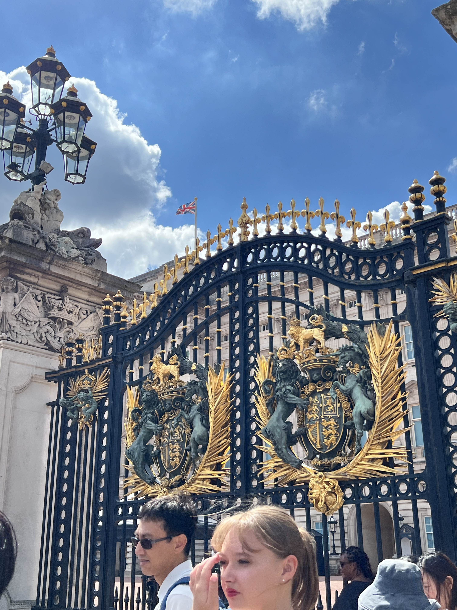
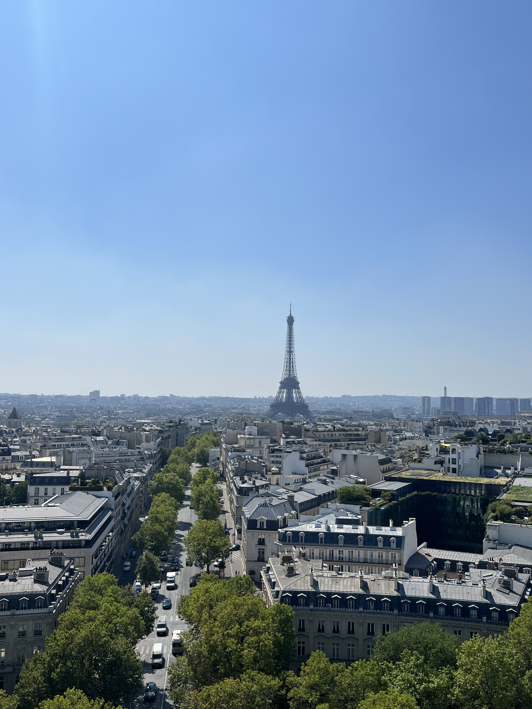
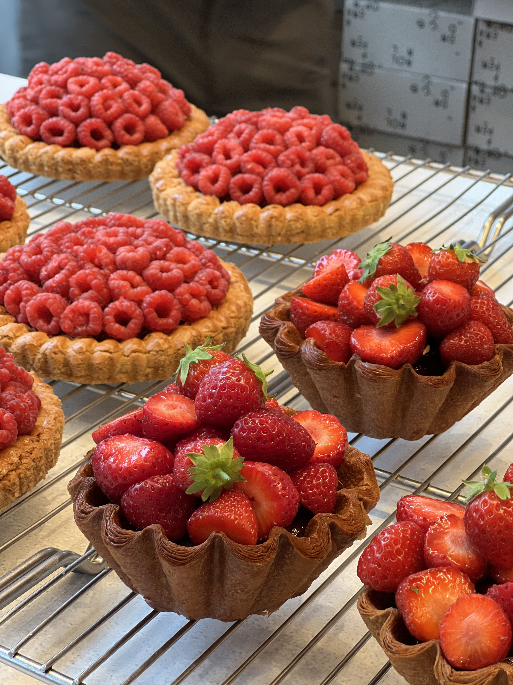
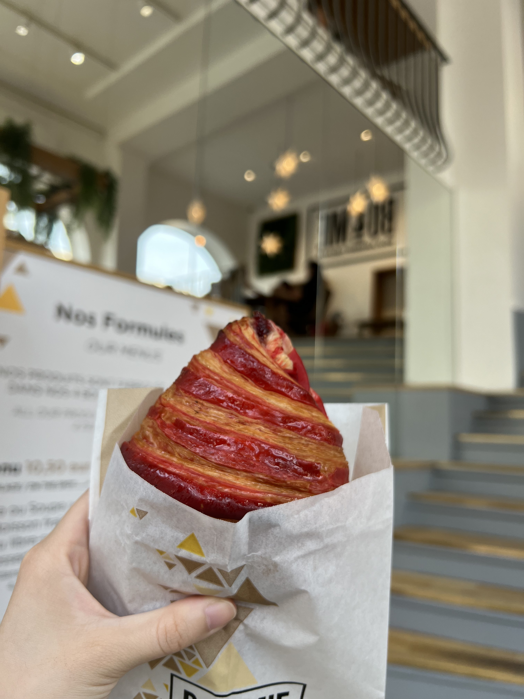
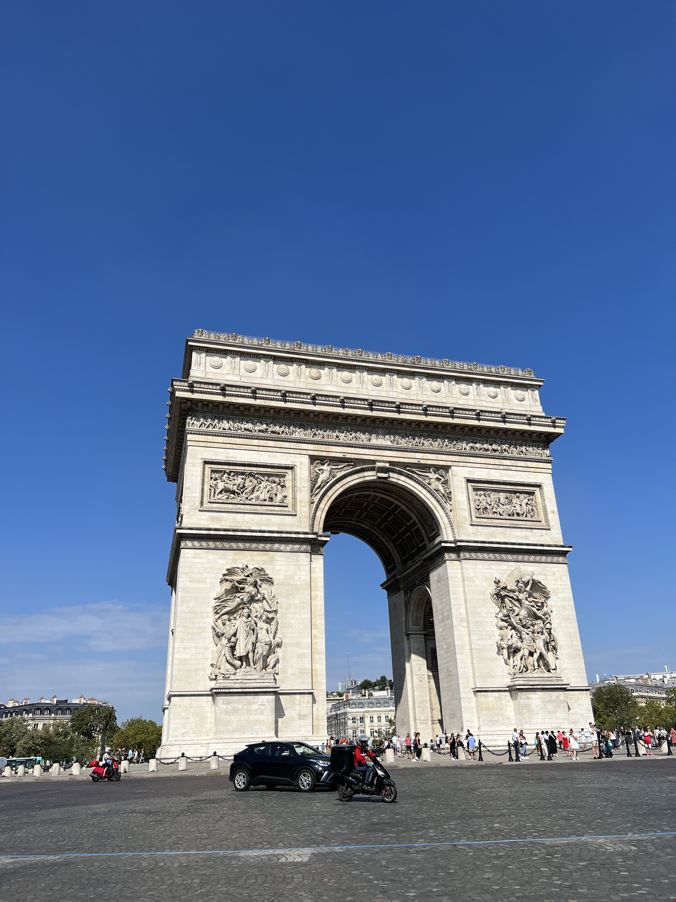
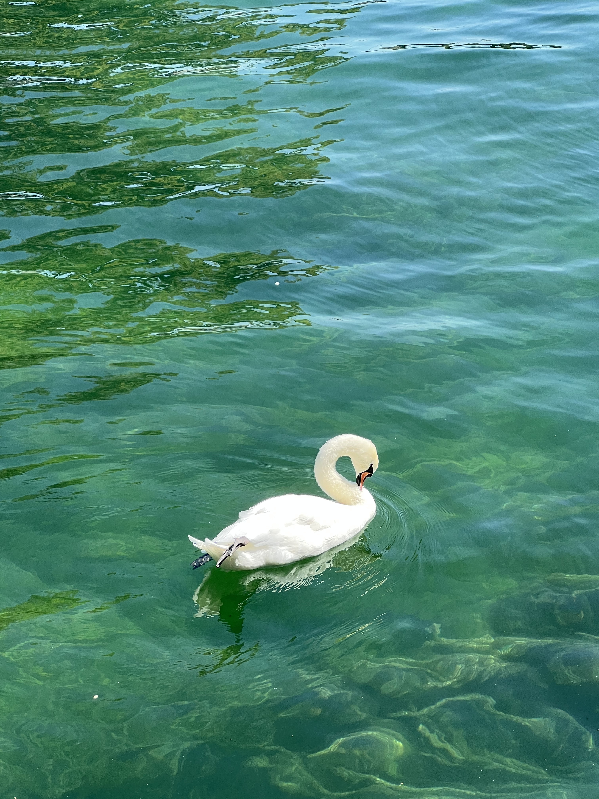
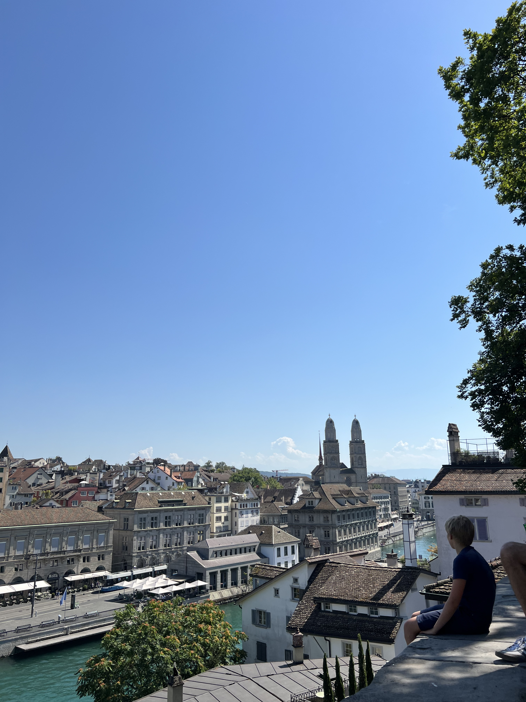
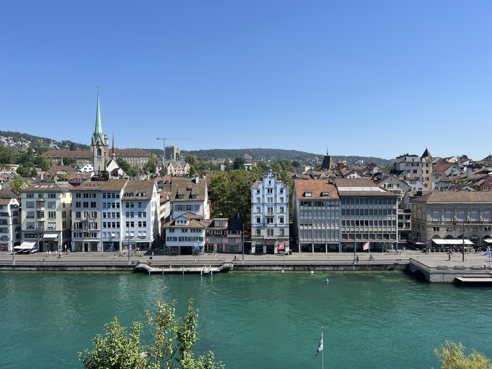

 

### London, UK

  

Would love to stay here for longer next time! Boo to gloomy weather all the time :(

 

### Paris, France

   

Can we talk about how perfect all the croissants are in Paris??!! 
Hands down, Cedric Grolet has the most perfect and amzing croissants and pastried.
Amazing food for amazing prices! There is so much to do as tourists and I would love to visit again in the winter. 

 

### Zürich, Switzerland

  

aka my future retirement home...

You will know exactly what I mean when you visit :)

